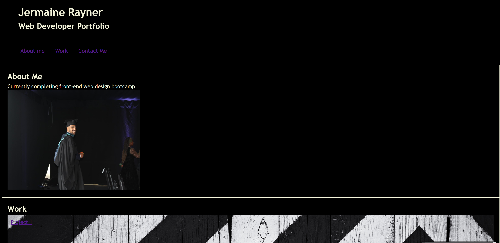
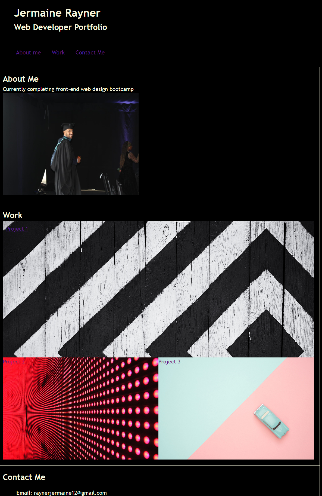

-Jermaine Rayner Portfolio

Description: This project was creating the base of my portfolio that can be updated in the future, a nav bar and various sections were created to structure the page. Also responsivness was added so the page strucutre adapts to screens below 600px.

Table of Contents: -Installation -Usage -Credits -License

Installation: Uploaded to online repository via git bash and github

Usage: Learn about my projects, about me and how to contact me.

Credits: Jermaine Rayner edx codecamp

License: n/a

Badges: n/a

Features: Page has multiple images descriptions with a list at top and sidebar. 
Structure changes under 600px, display changes to grid and div sizes change to adjust to smaller scree. 
When clicking links on nav bar page will scroll down to section. Link at bottom will take you to personal linkden page in new tab. 
Work link will take you to github products in new tab.

Tests: Multiple trail and error tests whilst updating css and functionality of page.

Screenshots:

Screen Below 600px

